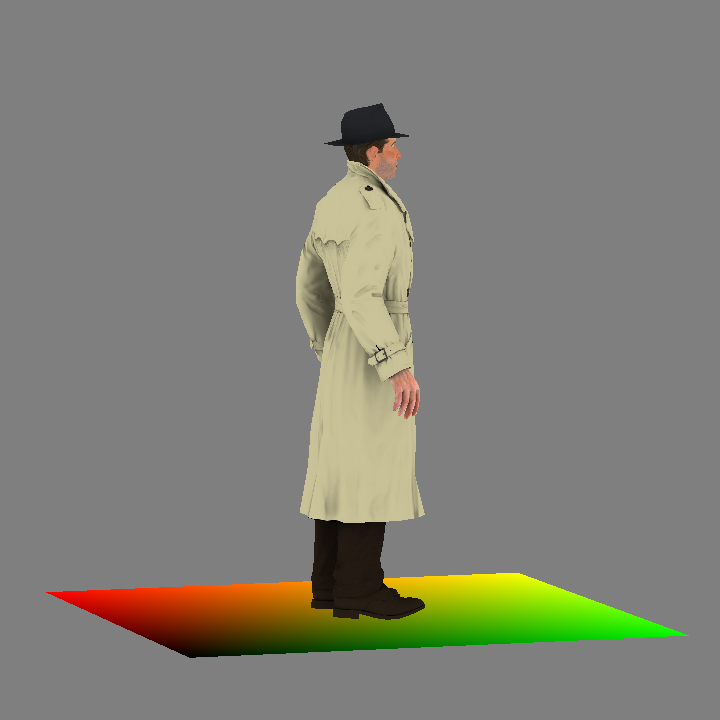
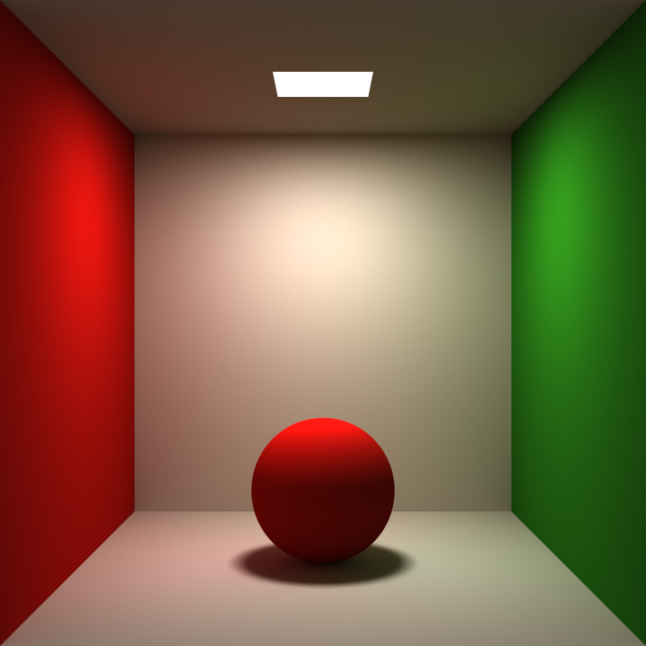
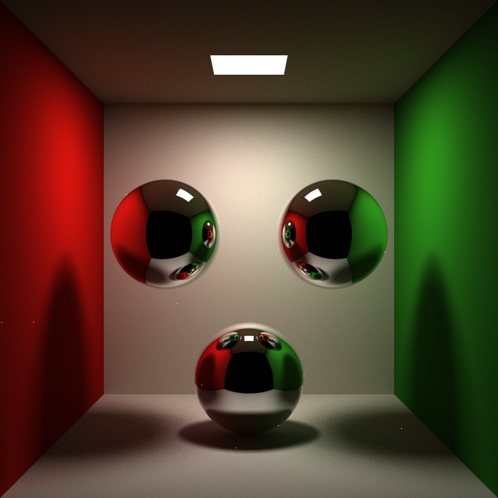
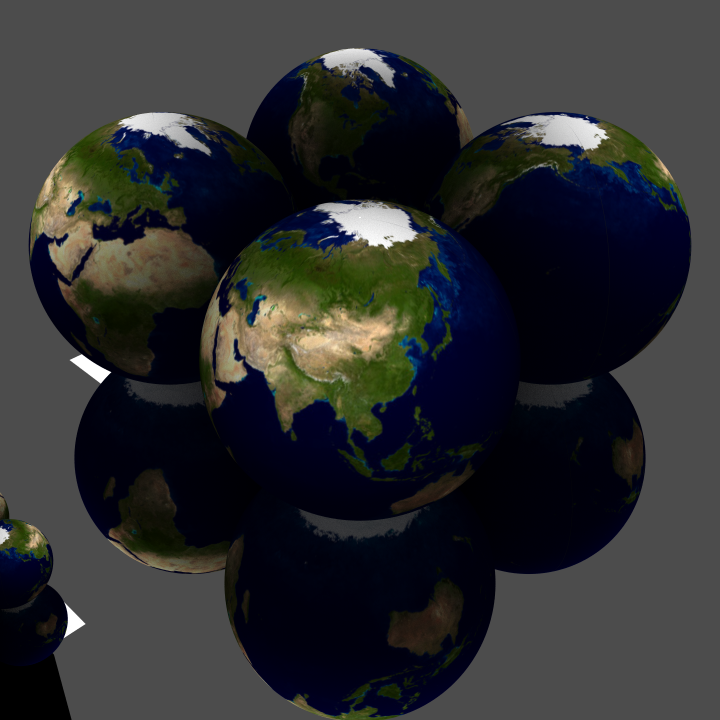

# Mini-Engine

一个迷你的图形引擎 .

基于C++20开发 , CMake构建 . 核心内容不依赖外部库 , GLFW仅用来显示渲染结果方便调试 .

实现了 光栅化 和 光线追踪 两种典型的渲染方法 .

实现了 矩阵&向量库 , 变换矩阵生成 , 模型读取 , 纹理 , 材质 , 反锯齿 , Shader , 阴影 等功能 .

# Demo

## 光栅化

<p align="center">
<strong>
boggie 1w face
</strong>
</p>



## 光线追踪

<p align="center">
<strong>
diffuse material ; 5k spp
</strong>
</p>



<p align="center">
<strong>
mirror material ; 500 spp
</strong>
</p> 



<p align="center">
<strong>
image texture ; 500 spp
</strong>
</p> 



# Feature

- [x] 数学
    - [x] 向量运算
    - [x] 矩阵运算
    - [x] 工具函数
- [x] 图元
    - [x] 球体
    - [x] 矩形
    - [ ] 三角形
    - [ ] 模型
- [ ] 材质
    - [x] 漫反射材质
    - [x] 镜面材质
    - [ ] 折射材质
    - [ ] 微表面材质
    - [ ] 迪士尼原则材质
- [ ] 纹理
    - [ ] 单色纹理
    - [ ] 图片纹理
    - [ ] 噪声纹理
- [x] 渲染
    - [x] 光栅化
    - [x] 光线追踪
    - [x] 着色器
    - [ ] 抗锯齿
- [ ] 加速结构
    - [ ] 包围盒
    - [ ] 层次包围盒
- [ ] 动力学
    - [ ] 碰撞检测
    - [ ] 刚体模拟
    - [ ] 流体模拟
    - [ ] 布料模拟

# 模块划分

_**PS:此文件结构不一定与当前源码一致**_

```
- engine                 // 引擎相关
  - math                 // 数学相关
    - vec.hpp            // 提供向量运算
    - mat.hpp            // 提供矩阵运算
    - utils.hpp          // 提供随机数,数学,向量,矩阵的工具类
  - tools                // 通用工具
    - average.hpp        // 平滑统计量
    - json.hpp           // json工具类
    - process.hpp        // 进度条类
  - data                 // 数据相关:渲染中用到的POD类
    - camera.hpp         // 管理摄像机属性
    - color.hpp          // 提供颜色运算
    - ray.hpp            // 提供射线定义
    - scene.hpp          // 读写场景文件:装载摄像机和模型信息
  - store                // 存储相关,需要导入导出的资源文件
    - image.hpp          // 读写图片文件
    - model.hpp          // 读写OBJ模型文件:包括顶点,图元,纹理信息
  - interface            // 接口相关
    - material.hpp       // 物体材质:定义BRDF规则
    - object.hpp         // 可渲染的图元:定义光线求交,包围盒计算规则
    - render.hpp         // 渲染器:输入场景信息,输出图片
    - shader.hpp         // 着色器:包括顶点着色器和片段着色器
    - texture.hpp        // 纹理信息:定义根据uv采样的规则
  - implement            // 接口的具体实现
    - material           // 具体的材质实现
      - default.hpp      // 默认材质:diffuse
      - diffuse.hpp      // 漫反射材质
      - mirror.hpp       // 镜面材质
      - refract.hpp      // *折射材质
      - micro.hpp        // *微表面材质
      - disney.hpp       // *迪士尼标准材质
    - objects            // 具体的图元实现
      - sphere.hpp       // 球体
      - rectangle.hpp    // 矩形
      - triangle.hpp     // *三角形
    - render             // 具体的渲染器实现
      - rt_render.hpp    // 光线追踪渲染器
      - rs_render.hpp    // 光栅化渲染器
    - texture            // 具体的纹理实现
      - mapping.hpp      // 图片映射纹理
      - solid.hpp        // 单色纹理
      - noise.hpp        // *噪声纹理
  - accelerator          // 加速结构
    - AABB.hpp           // 包围盒
    - BVH.hpp            // *层次包围盒
  - dynamics             // 动力学相关
    - collision.hpp      // *碰撞检测算法
    - simulation         // 物理模拟
      - rigid.hpp        // *刚体模拟
      - fluid.hpp        // *流体模拟
      - cloth.hpp        // *布料模拟
- view                   // 显示+控制层
  - gui.hpp              // 负责实时呈现渲染结果
- main.cpp               // 入口文件,负责程序参数的解析
```

# 成像方法

## 光栅化

光栅化成像方法是实时渲染中广泛应用的一种技术 , 流程如下 .

- 输入图元
- 执行顶点着色器 , 对图元进行坐标变换
    - 模型变换 : 局部坐标 => 世界坐标
    - 视图变换 : 世界坐标 => 观察坐标
    - 剪切变换 : 观察坐标 => 裁剪坐标
- 对与-1,1有交点的图元进行裁剪形成新的图元
- 对每个图元进行光栅化转换为片元
- 插值获取片元信息 , 并执行片元着色器
- 屏幕变换 : 裁剪坐标 => 屏幕坐标
- 呈现图片

## 光线追踪

光线追踪的成像方法质量更高 , 开销也会更大 , 本项目后期会做实现 .

### Whittled-Style Ray Tracing

- 摄像机为视口上每个像素随机选取spp个采样点发射感受光
- 使用高效筛选图元的方法(如AABB,BVH)寻找可能碰撞的图元
- 求解碰撞方程,计算碰撞点的光照信息
- 判断碰撞点是否可被光源照射,并统计可见点信息
- 根据碰撞点的材质计算反射和折射光,递归执行
- 将所有可见点信息根据某种光照模型作为最终像素信息
- 显示图像

### Path Tracing

- 摄像机为视口上每个像素随机选取spp个采样点发射感受光
- 使用高效筛选图元的方法(如AABB,BVH)寻找可能碰撞的图元
- 求解碰撞方程,计算碰撞点的光照信息
- 随机选取一个光源上的坐标,作为入射路径进行采样
- 对非光源随机发射一条新路径采样
- 累加两次计算的结果作为返回值
- 显示图像

### 实时光追

To Implement ...

# 着色器

顶点着色器 :

- gl_Position - in-out  
  顶点坐标
- gl_TexCoord - in  
  纹理坐标
- gl_Color - out  
  点的颜色

片元着色器 :

- gl_FragCoord - in  
  片元坐标
- gl_TexCoord - in  
  纹理坐标
- gl_FragColor - out  
  片元颜色
- gl_Discard - out  
  是否丢弃片元,如果丢弃则使用顶点着色器的信息进行插值
