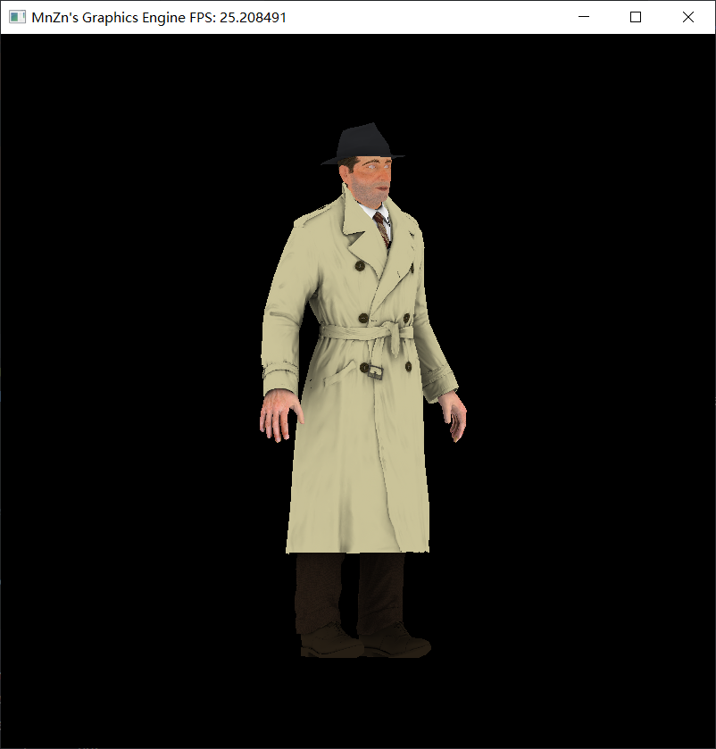

# Mini-Engine

一个迷你的图形引擎 .

基于C++20开发 , CMake构建 . 核心内容不依赖外部库 .

实现了 矩阵&向量运算及其工厂函数 , 模型&纹理读取 , 透视投影 , 反锯齿 , Shader接口 , 光线阴影 等功能.

还通过GLFW的UI相关库(不涉及核心渲染过程) , 将渲染结果和平均帧率实时显示在可视化界面中 .

# 运行效果



# 成像方法

## 光栅化

光栅化成像方法一直是实时渲染中广泛应用的一种技术 , 流程如下 .

- 输入需要渲染的所有图元
- 运行顶点着色器  
  负责根据变换(模型+视图+透视)输出顶点坐标.
- 图元装配
  负责将视锥体(可见空间)外的图元过滤,派发给不同光栅化函数.
- 光栅化  
  负责将图元(3D信息)转为片元.
- 运行片元着色器  
  负责输出每个像素的颜色.
- 输出到缓存区  
  深度检测,透明度,阴影等.

## 光线追踪

光线追踪的成像方法质量更高 , 当然开销也会更大 , 本项目暂不做实现 .

- 摄像机为视口上每个像素发射感受光
- 使用高效筛选三角形面的方法(包围盒)寻找碰撞面
- 通过解线性方程组计算碰撞点,并判断是否位于三角形内部
- 判断碰撞点是否可被光源照射,并统计可见点信息
- 根据碰撞点的材质计算反射和折射光
- 将所有可见点信息累加作为最初像素的信息
- 显示图像

# 着色器

顶点着色器 :

- gl_Position - in-out  
  顶点坐标
- gl_TexCoord - in  
  纹理坐标
- gl_Color - out  
  点的颜色

片元着色器 :

- gl_FragCoord - in  
  片元坐标
- gl_TexCoord - in  
  纹理坐标
- gl_FragColor - out  
  片元颜色
- gl_Discard - out  
  是否丢弃片元,如果丢弃则使用顶点着色器的信息进行插值

# 模块划分

```
- math              // 数学相关
    - vec.hpp       // 提供向量(也可视为点)运算
    - utils.hpp     // 提供常用的数学相关函数
    - mat.hpp       // 提供矩阵运算
- engine            // 引擎相关
    - camera.hpp    // 管理摄像机属性
    - model.hpp     // 储存顶点,三角形数据,可从文件加载
    - shader.hpp    // 着色器,包括顶点着色器和片段着色器
    - render.hpp    // 根据摄像机+光源+模型信息通过光栅化成像输出为图片
- view              // 显示相关
    - color.hpp     // 提供颜色运算
    - image.hpp     // 储存像素,作为引擎的输出
    - gui.hpp       // 维护维护摄像机位置,实时渲染引擎输出并显示帧率
- main.cpp          // 入口文件,负责程序参数的解析
```