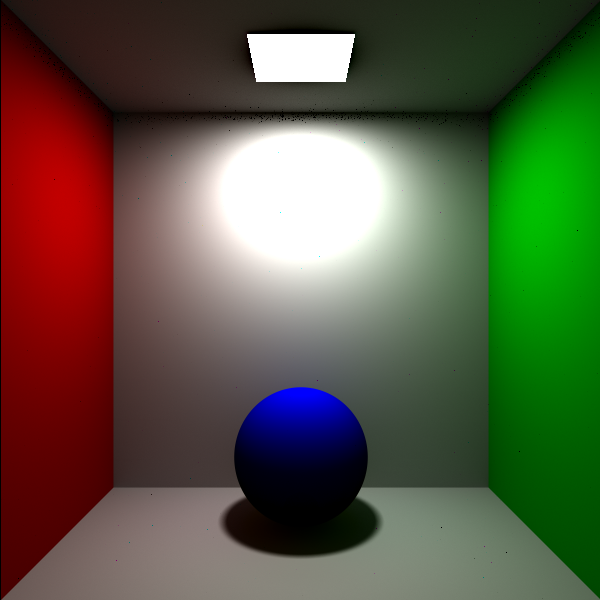
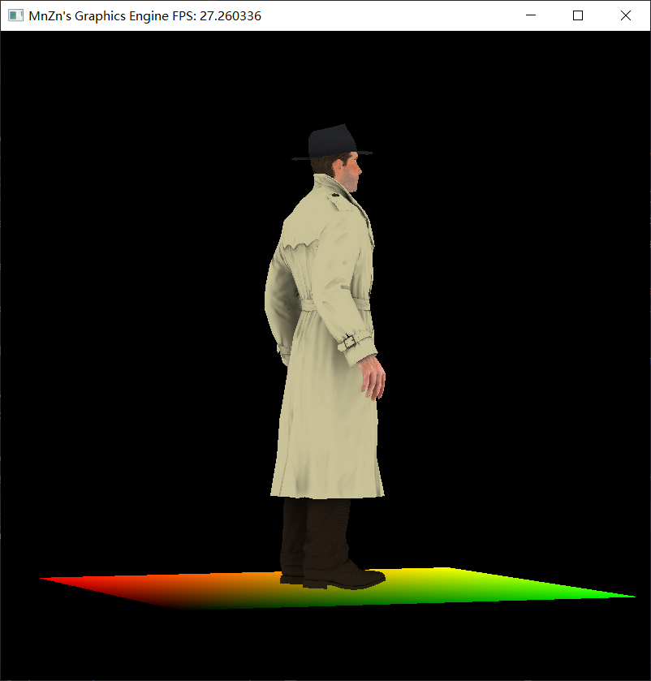

<p align="center">

</p>
<p align="center">
软光线追踪渲染器 600p×600p | 10000spp
&nbsp;&nbsp;&nbsp;&nbsp;&nbsp;&nbsp;&nbsp;&nbsp;&nbsp;&nbsp;&nbsp;&nbsp;
&nbsp;&nbsp;&nbsp;&nbsp;&nbsp;&nbsp;&nbsp;&nbsp;&nbsp;&nbsp;&nbsp;&nbsp;
&nbsp;&nbsp;&nbsp;&nbsp;&nbsp;&nbsp;&nbsp;&nbsp;&nbsp;&nbsp;&nbsp;&nbsp;
软光栅化渲染器 800px800px | 1w face
</p>

# Mini-Engine

一个迷你的图形引擎 .

基于C++20开发 , CMake构建 . 核心内容不依赖外部库 , GLFW仅用来显示渲染结果方便调试 .

实现了 光栅化 和 光线追踪 两种典型的渲染方法 .

实现了 矩阵&向量库 , 变换矩阵生成 , 模型&纹理读取 , 反锯齿 , Shader , 阴影 等功能 .

# Feature

- [x] 数学
    - [x] 向量运算
    - [x] 矩阵运算
    - [x] 工具函数
- [x] 图元
    - [x] 球体
    - [x] 矩形
    - [ ] 三角形
- [ ] 材质
    - [x] 漫反射
    - [ ] 镜面反射
- [x] 渲染
    - [x] 光栅化
    - [x] 光线追踪
    - [ ] 着色器
- [ ] 加速算法
    - [ ] 包围盒
    - [ ] 层次包围盒
- [ ] 物理
    - [ ] 碰撞检测
    - [ ] 流体模拟
    - [ ] 布料模拟

# 成像方法

## 光栅化

光栅化成像方法是实时渲染中广泛应用的一种技术 , 流程如下 .

- 输入图元
- 执行顶点着色器 , 对图元进行坐标变换
    - 模型变换 : 局部坐标 => 世界坐标
    - 视图变换 : 世界坐标 => 观察坐标
    - 剪切变换 : 观察坐标 => 裁剪坐标
- 对与-1,1有交点的图元进行裁剪形成新的图元
- 对每个图元进行光栅化转换为片元
- 插值获取片元信息 , 并执行片元着色器
- 屏幕变换 : 裁剪坐标 => 屏幕坐标
- 呈现图片

## 光线追踪

光线追踪的成像方法质量更高 , 开销也会更大 , 本项目后期会做实现 .

### Whittled-Style Ray Tracing

- 摄像机为视口上每个像素随机选取spp个采样点发射感受光
- 使用高效筛选图元的方法(如AABB,BVH)寻找可能碰撞的图元
- 求解碰撞方程,计算碰撞点的光照信息
- 判断碰撞点是否可被光源照射,并统计可见点信息
- 根据碰撞点的材质计算反射和折射光,递归执行
- 将所有可见点信息根据某种光照模型作为最终像素信息
- 显示图像

### Path Tracing

- 摄像机为视口上每个像素随机选取spp个采样点发射感受光
- 使用高效筛选图元的方法(如AABB,BVH)寻找可能碰撞的图元
- 求解碰撞方程,计算碰撞点的光照信息
- 随机选取一个光源上的坐标,作为入射路径进行采样
- 对非光源随机发射一条新路径采样
- 累加两次计算的结果作为返回值
- 显示图像

# 着色器

顶点着色器 :

- gl_Position - in-out  
  顶点坐标
- gl_TexCoord - in  
  纹理坐标
- gl_Color - out  
  点的颜色

片元着色器 :

- gl_FragCoord - in  
  片元坐标
- gl_TexCoord - in  
  纹理坐标
- gl_FragColor - out  
  片元颜色
- gl_Discard - out  
  是否丢弃片元,如果丢弃则使用顶点着色器的信息进行插值

# 模块划分

```
- engine              // 引擎相关
  - math              // 数学相关
    - vec.hpp         // 提供向量(也可视为点)运算
    - utils.hpp       // 提供常用的数学相关函数
    - mat.hpp         // 提供矩阵运算
  - data              // 数据相关,渲染中用到的杂项类
    - camera.hpp      // 管理摄像机属性
    - color.hpp       // 提供颜色运算
    - ray.hpp         // 射线
    - scene.hpp       // 管理图元的场景
  - store             // 存储相关,需要导入导出的资源文件
    - model.hpp       // 储存顶点,图元数据,可从文件加载
    - image.hpp       // 储存BMP图片
    - texture.hpp     // 储存纹理文件
  - interface         // 接口相关
    - shader.hpp      // 着色器,包括顶点着色器和片段着色器
    - render.hpp      // 渲染器,输入摄像机+光源+模型信息,输出图片
    - material.hpp    // 物体材质,定义BRDF和采样规则
    - object.hpp      // 可渲染的图元,定义光线求交,光源采样等规则
  - accelerator       // 加速结构
    - AABB.hpp        // 包围盒
    - BVH.hpp         // 层次包围盒
  - material          // 具体的材质实现
    - default.hpp     // 默认材质(diffuse)
    - diffuse.hpp     // 漫反射材质
  - objects           // 具体的图元实现
    - sphere.hpp      // 球体
    - rectangle.hpp   // 矩形
  - physical          // 物理相关
    - collision.hpp   // 碰撞检测算法
    - simulation      // 动画与模拟
      - fluid.hpp     // 布料模拟
      - cloth.hpp     // 流体模拟
  - render            // 渲染相关
    - rt_render.hpp   // 光线追踪(Ray Tracing)渲染器,使用Path Tracing算法
    - rs_render.hpp   // 光栅化(Rasterization)渲染器
- view                // 显示+控制层
  - gui.hpp           // 维护摄像机位置,实时渲染引擎输出并显示帧率
- main.cpp            // 入口文件,负责程序参数的解析
```